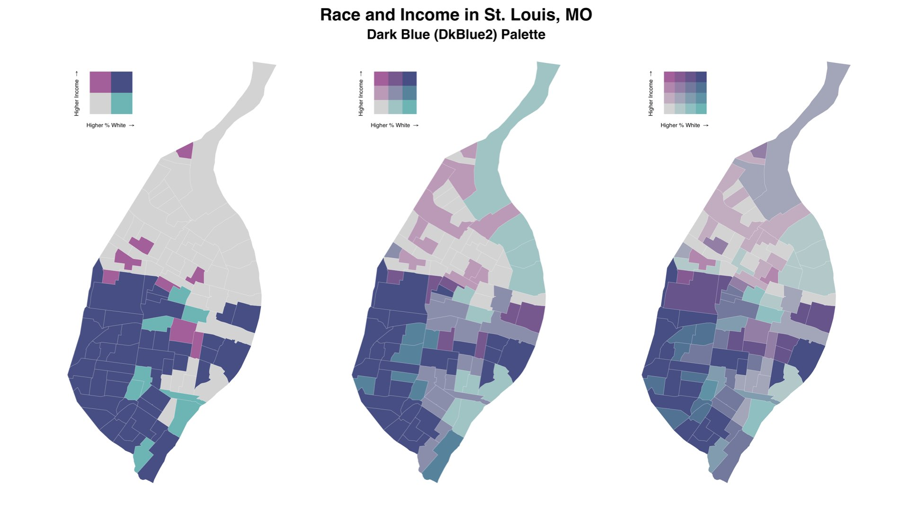

<!-- README.md is generated from README.Rmd. Please edit that file -->

# biscale 


[](https://codecov.io/github/chris-prener/biscale?branch=main)
[](https://cran.r-project.org/package=biscale)
[](https://cran.r-project.org/web/checks/check_results_biscale.html)
[](https://www.r-pkg.org/pkg/biscale)
[](https://zenodo.org/badge/latestdoi/183024212)

`biscale` implements a set of functions for bivariate thematic mapping
based on the
[tutorial](https://timogrossenbacher.ch/2019/04/bivariate-maps-with-ggplot2-and-sf/)
written by Timo Grossenbacher and Angelo Zehr as well as a set of
bivariate mapping palettes, including Joshua Stevens’ [classic color
schemes](https://www.joshuastevens.net/cartography/make-a-bivariate-choropleth-map/).



In addition to support for two-by-two, three-by-three, and four-by-four
maps, the package also supports a range of methods for calculating
breaks for bivariate maps.

## What’s New in v1.0.0?

### New Features

-   `bi_class()` now accepts factors for one or both of the `x` and `y`
    variables, allowing more flexibility for how breaks are calculated.
    If you want finer grained control over your categories, calculate
    them ahead of time and then pass the factors on to `bi_class()`.
-   `bi_pal()`, `bi_legend()`, `bi_scale_fill()`, and `bi_scale_color()`
    functions all support four-by-four bivariate maps when `dim = 4`.
    Note that the original five palettes do not support four-by-four
    mapping, but very close approximations (e.g. `DkBlue2` instead of
    `DkBlue`) are now provided in their place. The legacy palettes are
    all still included in the package.
-   The number of built-in palettes has been greatly expanded!
-   Palettes can now be flipped and rotated (or both!), so that each
    built-in palette can be displayed in four different configurations.
    This includes the built-in palettes and any custom palettes that are
    four-by-four or smaller. If you want to flip or rotate larger
    palettes, you should make those decisions while creating the palette
    itself.
-   The workflow for allowing custom palettes has been overhauled to
    simply the process - users can provide a named vector for the `pal`
    arguments in the `bi_pal()`, `bi_legend()`, `bi_scale_fill()`, and
    `bi_scale_color()` functions. All of these functions will validate
    your input to ensure that it maps correctly.
-   `bi_class()` can be used to calculate bivariate breaks for maps
    larger than four-by-four, though it will return a warning reminding
    you that these maps are hard to read and that `biscale` does not
    provide palettes for larger maps. Instead, you should provide a
    custom palette.
-   `bi_class_breaks()` can be used with `bi_legend()` to facilitate
    optionally adding break values to your legends. Like `bi_class()`,
    this new function accepts both continuous and pre-made factors.

### Breaking Changes

-   `R` version 3.4 is no longer supported - please use at least `R`
    version 3.5
-   There is no default supplied for `bi_class()`’s `style` argument
    since `bi_class()` now accepts factors as well. Users that relied on
    the default behavior of `bi_class()` will now receive an error
    asking you to specify a `style` for calculating breaks.

### Deprecated Functions

-   `bi_pal_manual()` now returns a warning that it has been deprecated
    and will be removed in a later release of `biscale` (planned for the
    end of 2022). Please update your workflows to use the new approach
    to generating custom palettes.

### Internal Improvements

-   `sf` is now a suggested package instead of an imported package, and
    several dependencies have been removed in the process of
    re-factoring all of the code in `biscale`.

### Documentation Improvements

-   Documentation updates have been made, including the addition of a
    number of new examples and vignettes. These include detailed
    articles on bivariate palettes, working with breaks and legends, and
    creating bivariate maps with raster data.

## Installation

### Installing biscale

The easiest way to get `biscale` is to install it from CRAN:

``` r
install.packages("biscale")
```

Alternatively, the development version of `biscale` can be accessed from
GitHub with `remotes`:

``` r
# install.packages("remotes")
remotes::install_github("chris-prener/biscale")
```

### Installing Suggested Dependencies

Since the package does not directly use functions from `sf`, it is a
suggested dependency rather than a required one. However, the most
direct approach to using `biscale` is with `sf` objects, and we
therefore recommend users install `sf`. Windows and macOS users should
be able to install `sf` without significant issues unless they are
building from source. Linux users will need to install several open
source spatial libraries to get `sf` itself up and running.

The other suggested dependency that users may want to consider
installing is `cowplot`. All of the examples in the package
documentation utilize it to construct final map images that combine the
map with the legend. Like `sf`, it is suggested because none of the
functions in `biscale` call `cowplot` directly.

If you want to use them, you can either install these packages
individually (faster) or install all of the suggested dependencies at
once (slower, will also give you a number of other packages you may or
may not want):

``` r
## install just cowplot and sf
install.packages(c("cowplot", "sf"))

## install all suggested dependencies
install.packages("biscale", dependencies = TRUE)
```

## Usage

### Quick Overview

Creating bivariate plots in the style described by [Grossenbacher and
Zehr](https://timogrossenbacher.ch/2019/04/bivariate-maps-with-ggplot2-and-sf/)
requires a number of dependencies in addition to `biscale` - `ggplot2`
for plotting and `sf` for working with spatial objects in `R`. We’ll
also use `cowplot` in these examples:

``` r
# load dependencies
library(biscale)
library(ggplot2)
library(cowplot)
library(sf)
```

The `biscale` package comes with some sample data from St. Louis, MO
that you can use to check out the bivariate mapping workflow. Our first
step is to create our classes for bivariate mapping. `biscale` currently
supports a both two-by-two and three-by-three tables of classes, created
with the `bi_class()` function:

``` r
# create classes
data <- bi_class(stl_race_income, x = pctWhite, y = medInc, style = "quantile", dim = 3)
```

The default method for calculating breaks is `"quantile"`, which will
provide breaks at 33.33% and 66.66% percent (i.e. tercile breaks) for
three-by-three palettes. Other options are `"equal"`, `"fisher"`, and
`"jenks"`. These are specified with the optional `style` argument. The
`dim` argument is used to adjust whether a two-by-two and three-by-three
tables of classes is returned.

Once breaks are created, we can use `bi_scale_fill()` as part of our
`ggplot()` call:

``` r
# create map
map <- ggplot() +
  geom_sf(data = data, mapping = aes(fill = bi_class), color = "white", size = 0.1, show.legend = FALSE) +
  bi_scale_fill(pal = "GrPink", dim = 3) +
  labs(
    title = "Race and Income in St. Louis, MO",
    subtitle = "Dark Blue (DkBlue) Palette"
  ) +
  bi_theme()
```

There are a variety of other options for palettes. See the “Bivarite
Palettes” vignette or `?bi_pal` for more details. The `bi_theme()`
function applies a simple theme without distracting elements, which is
preferable given the already elevated complexity of a bivariate map. We
need to specify the dimensions of the palette for `bi_scale_fill()` as
well.

To add a legend to our map, we need to create a second `ggplot` object.
We can use `bi_legend()` to accomplish this, which allows us to easily
specify the fill palette, the x and y axis labels, and their size along
with the dimensions of the palette:

``` r
legend <- bi_legend(pal = "GrPink",
                    dim = 3,
                    xlab = "Higher % White ",
                    ylab = "Higher Income ",
                    size = 8)
```

Note that
[`plotmath`](https://stat.ethz.ch/R-manual/R-devel/library/grDevices/html/plotmath.html)
is used to draw the arrows since Unicode arrows are font dependent. This
happens internally as part of `bi_legend()` - you don’t need to include
them in your `xlab` and `ylab` arguments!

With our legend drawn, we can then combine the legend and the map with
`cowplot`. The values needed for this stage will be subject to
experimentation depending on the shape of the map itself.

``` r
# combine map with legend
finalPlot <- ggdraw() +
  draw_plot(map, 0, 0, 1, 1) +
  draw_plot(legend, 0.2, .65, 0.2, 0.2)
```

The completed map, created with the sample code in this README, looks
like this:


## Contributor Code of Conduct

Please note that this project is released with a [Contributor Code of
Conduct](https://chris-prener.github.io/biscale/CODE_OF_CONDUCT.html).
By participating in this project you agree to abide by its terms.
