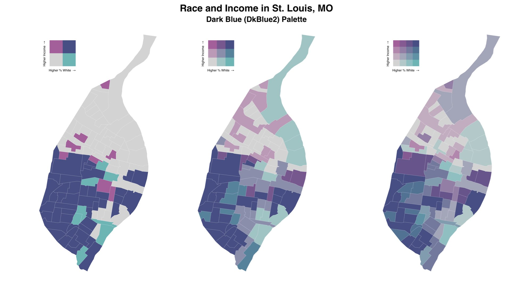

# biscale 


[](https://codecov.io/github/slu-openGIS/biscale?branch=main)
[](https://cran.r-project.org/package=biscale)
[](https://cran.r-project.org/web/checks/check_results_biscale.html)
[](http://www.r-pkg.org/pkg/biscale)
[](https://zenodo.org/badge/latestdoi/183024212)

`biscale` implements a set of functions for bivariate thematic mapping based on the [tutorial](https://timogrossenbacher.ch/2019/04/bivariate-maps-with-ggplot2-and-sf/) written by Timo Grossenbacher and Angelo Zehr as well as a set of bivariate mapping palettes, including Joshua Stevens' [classic color schemes](http://www.joshuastevens.net/cartography/make-a-bivariate-choropleth-map/). 



In addition to support for two-by-two, three-by-three, and four-by-four maps, the package also supports a range of methods for calculating breaks for bivariate maps.

## What's New in v1.0.0.9000?
### New Features
  * `bi_class()` now accepts factors for one or both of the `x` and `y` variables, allowing more flexibility for how breaks are calculated
  * `bi_pal()`, `bi_legend()`, and `bi_scale_...` functions all support four-by-four bivariate maps when `dim = 4`. Note that the original five palettes do not support four-by-four mapping, but very close approximations (e.g. `DkBlue2` instead of `DkBlue`) are now provided in their place. The legacy palettes are all still included in the package.
  * The number of built-in palettes has been greatly expanded
  * Palettes can now be flipped and rotated (or both!), so that each built-in palette can be displayed in four different configurations
  * The workflow for allowing custom palettes has been overhauled to simply the process - users can provide a named vector for the `pal` arguments in the `bi_pal()`, `bi_legend()`, and `bi_scale_...` functions
  * `bi_class()` can be used to calculate bivariate breaks for maps larger than four-by-four, though it will return a warning reminding you that these maps are hard to read and that `biscale` does not provide palettes for larger maps. Instead, you should provide a custom palette.
  * `bi_class_breaks()` can be used with `bi_legend()` to facilitate optionally adding break values to your legends

### Breaking Changes
  * There is no default supplied for `bi_class()`'s `style` argument since `bi_class()` now accepts factors as well
  * Changes to `bi_legend()` to facilitate breaks mean that there are new arguments to be aware of
  
### Deprecated Functions
  * `bi_pal_manual()` now returns a warning that it has been deprecated and will be removed in a later release of `biscale`. Please update your workflows to use the new approach to generating custom palettes.
  
### Internal Improvements
  * `sf` is now a suggested package instead of an imported package, and several dependencies have been removed in the process of re-factoring all of the code in `biscale`

## Quick Start

If the `sf` package is already installed, the development version of `biscale` can be accessed from GitHub with `remotes`:

``` r
install.packages("biscale")
```

Alternatively, the development version of `biscale` can be accessed from GitHub with `remotes`:

``` r
# install.packages("remotes")
remotes::install_github("slu-openGIS/biscale")
```

Additional details, including some tips for installing `sf`, can be found in the [Get started article](articles/biscale.html#getting-started).

## Resources

In addition to instructions for installation, the main [Get started](articles/biscale.html) article has:

  - a quick overview of bivariate mapping,
  - a description of the workflow for creating bivariate maps,
  - a comparison of different approaches to calculating those classes,
  - and a comparison of different color palettes for bivariate mapping.
