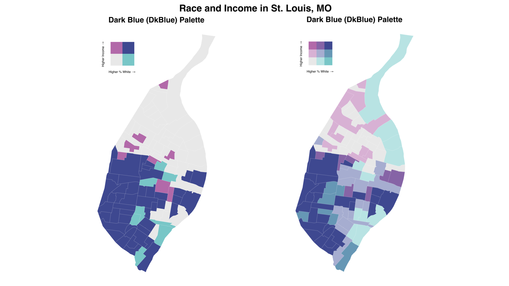
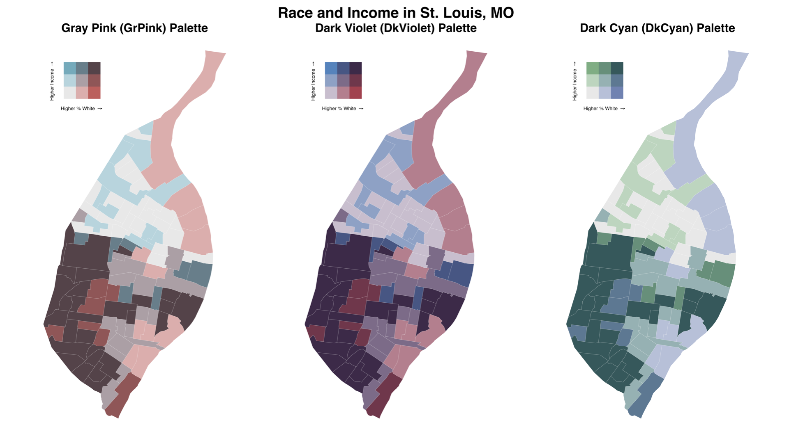

```{r setup, include = FALSE}
knitr::opts_chunk$set(
  collapse = TRUE,
  comment = "#>"
)
```

Thematic choropleth maps are used to display quantities of some variable within areas, such as mapping median income across a city's neighborhoods. However, we often think in bivariate terms - "how do race and income vary together?". Maps that captures this, known as bivariate choropleth maps, are often perceived as difficult to create and interpret. The goal of `biscale` is to implement a consistent approach to bivariate mapping entirely within `R`. The package's workflow is based on a recent [tutorial](https://timogrossenbacher.ch/2019/04/bivariate-maps-with-ggplot2-and-sf/) written by Timo Grossenbacher and Angelo Zehr, and supports both two-by-two and three-by-three bivariate maps.

```{r exampleMap, echo=FALSE, out.width = '100%'}

```

## Getting Started
### Installation
Since the package does not directly use functions from `sf`, it is a suggested dependency rather than a required one. However, the most direct approach to using `biscale` is with `sf` objects, and we therefore recommend users install `sf` before proceeding with using `biscale`. Windows users should be able to install `sf` without significant issues, but macOS and Linux users will need to install several open source spatial libraries to get `sf` itself up and running. The easiest approach for macOS users is to install the GDAL 2.0 Complete framework from [Kyng Chaos](https://www.kyngchaos.com/software/frameworks/). 

For Linux users, steps will vary based on the flavor being used. Our [configuration file](https://github.com/slu-openGIS/biscale/blob/master/.travis.yml) for Travis CI and its associated [bash script](https://github.com/slu-openGIS/biscale/blob/master/.travis/install.sh) should be useful in determining the necessary components to install.

Once `sf` is installed, the easiest way to get `biscale` is to install it from CRAN:

```r
install.packages("biscale")
```

Alternatively, the development version of `biscale` can be accessed from GitHub with `remotes`:

```r
# install.packages("remotes")
remotes::install_github("slu-openGIS/biscale")
```

### Functions
All functions within `biscale` use the prefix `bi_` to leverage the auto-completion features of RStudio and other IDEs. 

### Data
`biscale` contains a data set of U.S. Census tracts for the City of St. Louis in Missouri. Both median income and the percentage of white residents are included, both of which can be used to demonstrate the package's functionality.

### Preparing Data
Once data are loaded, bivariate classes can be applied with the `bi_class()` function. There is an *important caveat*, however:

```r
> # load dependencies
> library(biscale)
>
> # create classes
> data <- bi_class(stl_race_income, x = pctWhite, y = medInc, style = "quantile", dim = 3)
Warning message:
In bi_class(stl_race_income, x = pctWhite, y = medInc, dim = 3) :
  The 'sf' package is not loaded, and the class 'sf' attribute of the given data set has been lost. Load 'sf' to retain the class when using 'bi_class'.
```

If you are going to be using `sf` objects, it is important that you load the `sf` package as well so that its methods can be correctly applied to your data:

```r
> # load dependencies
> library(biscale)
> library(sf)
>
> # create classes
> data <- bi_class(stl_race_income, x = pctWhite, y = medInc, style = "quantile", dim = 3)
```

This warning will not be generated if `sf` is loaded, or if you are using `bi_class()` on a non-`sf` object (which leaves room for folks who use other tools like `sp`, or who are applying classes to tibbles or data frames).

The `dim` argument is used to control the extent of the legend - do you want to produce a two-by-two map (`dim = 2`) or a three-by-three map (`dim = 3`)?

Classes can be applied with the `style` parameter using four approaches for calculating breaks: `"quantile"` (default), `"equal"`, `"fisher"`, and `"jenks"`. The default `"quantile"` approach will create relatively equal "buckets" of data for mapping, with a break created at the median (50th percentile) for a two-by-two map or at the 33rd and 66th percentiles for a three-by-three map. 

```{r quantileBreaks, echo=FALSE, out.width = '100%'}
knitr::include_graphics("../man/figures/biscale.004.png")
```

With the sample data, this creates a *very* broad range for the percent white measure in particular. Using one of the other approaches to calculating breaks yields a narrower range for the breaks and produces a map that does not overstate the percent of white residents living on the north side of St. Louis:

```{r otherBreaks, echo=FALSE, out.width = '100%'}
knitr::include_graphics("../man/figures/biscale.005.png")
```

### Mapping Data
Once breaks are created, we can use `bi_scale_fill()` as part of our `ggplot()` call:

```r
# create map
map <- ggplot() +
  geom_sf(data = data, mapping aes(fill = bi_class), color = "white", size = 0.1, show.legend = FALSE) +
  bi_scale_fill(pal = "DkBlue", dim = 3) +
  labs(
    title = "Race and Income in St. Louis, MO",
    subtitle = "Dark Blue (DkBlue) Palette"
  ) +
  bi_theme()
```

This requires that the variable `bi_class`, created with `bi_class()`, is used as the fill variable in the aesthetic mapping. We also want to remove the legend from the plot since it will not accurately communicate the complexity of the bivariate scale.

The dimensions of the scale must again be supplied for `bi_scale_fill()` (they should match the dimensions given for `bi_class()`!), and a palette must be given. Options for palettes are `"Brown"`, `"DkBlue"`, `"DkCyan"`, `"DkViolet"`, or `"GrPink"`. The `"DkViolet"` was created by [Timo Grossenbacher and Angelo Zehr](https://timogrossenbacher.ch/2019/04/bivariate-maps-with-ggplot2-and-sf/), and the other four palettes were created by [Joshua Stevens](http://www.joshuastevens.net/cartography/make-a-bivariate-choropleth-map/). The first map in this vignette uses the `"GrPink"` palette. Other two-by-two palettes look like so:

```{r 2by2Pals, echo=FALSE, out.width = '100%'}
knitr::include_graphics("../man/figures/biscale.002.png")
```

Here are several other three-by-three palettes:

```{r 3by3Pals, echo=FALSE, out.width = '100%'}

```

The `"Brown"` palette is not pictured, but can be previewed (along with the other palettes) using the `bi_pal()` function. The same function can also be used to return vectors of color hex values as well. Samples of each palette are available on the [package website](https://slu-opengis.github.io/biscale/reference/bi_pal.html).

The example above also includes `bi_theme()`, which is based on the theme designed by [Timo Grossenbacher and Angelo Zehr](https://timogrossenbacher.ch/2019/04/bivariate-maps-with-ggplot2-and-sf/). This theme creates a simple, clean canvas for bivariate mapping that removes any possible distracting elements.

### Creating Legends
We've set `show.legend = FALSE` so that we can add (manually) our own bivariate legend. The legend itself can be created with the `bi_legend()` function:

```r
legend <- bi_legend(pal = "DkBlue",
                    dim = 3,
                    xlab = "Higher % White ",
                    ylab = "Higher Income ",
                    size = 8)
```

The palette and dimensions should match what has been used for both `bi_class()` (in terms of dimensions) and `bi_scale_fill()` (in terms of both dimensions and palette). The `size` argument controls the font size used on the legend. Note that [`plotmath`](https://stat.ethz.ch/R-manual/R-devel/library/grDevices/html/plotmath.html) is used to draw the arrows since Unicode arrows are font dependent. This happens internally as part of `bi_legend()` - you don't need to include them in your `xlab` and `ylab` arguments!

With our legend drawn, we can then combine the legend and the map with `cowplot`. Like `sf`, `cowplot` is a suggested rather than required dependency. The values needed for this stage will be subject to experimentation depending on the shape of the map itself.

```r
# combine map with legend
finalPlot <- ggdraw() +
  draw_plot(map, 0, 0, 1, 1) +
  draw_plot(legend, 0.2, .7, 0.2, 0.2)
```

This approach allows us to customize legend's placement and size to suit different map layouts. All of the maps shown as part of this vignette were produced using this approach.

## Getting Help
* If you are new to `R` itself, welcome! Hadley Wickham's [*R for Data Science*](http://r4ds.had.co.nz) is an excellent way to get started with data manipulation in the tidyverse, which `areal` is designed to integrate seamlessly with.
* If you are new to spatial analysis in `R`, we strongly encourage you check out the excellent new [*Geocomputation in R*](https://geocompr.robinlovelace.net) by Robin Lovelace, Jakub Nowosad, and Jannes Muenchow.
* If you have questions about using `areal`, you are encouraged to use the [RStudio Community forums](https://community.rstudio.com). Please create a [`reprex`](http://reprex.tidyverse.org/) before posting. Feel free to tag Chris (`@chris.prener`) in any posts about `areal`.
* If you think you've found a bug, please create a [`reprex`](http://reprex.tidyverse.org/) and then open an issue on [GitHub](https://github.com/slu-openGIS/biscale/issues/new/choose).

## Suggesting Features or Changes
If you have features or suggestions you want to see implemented, please open an issue on [GitHub](https://github.com/slu-openGIS/biscale/issues/new/choose) (and ideally created a [`reprex`](http://reprex.tidyverse.org/) to go with it!). Please note that this project is released with a [Contributor Code of Conduct](.github/CODE_OF_CONDUCT.md). By participating in this project you agree to abide by its terms.
