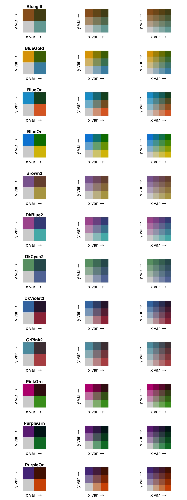
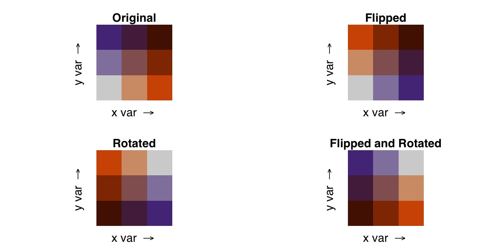
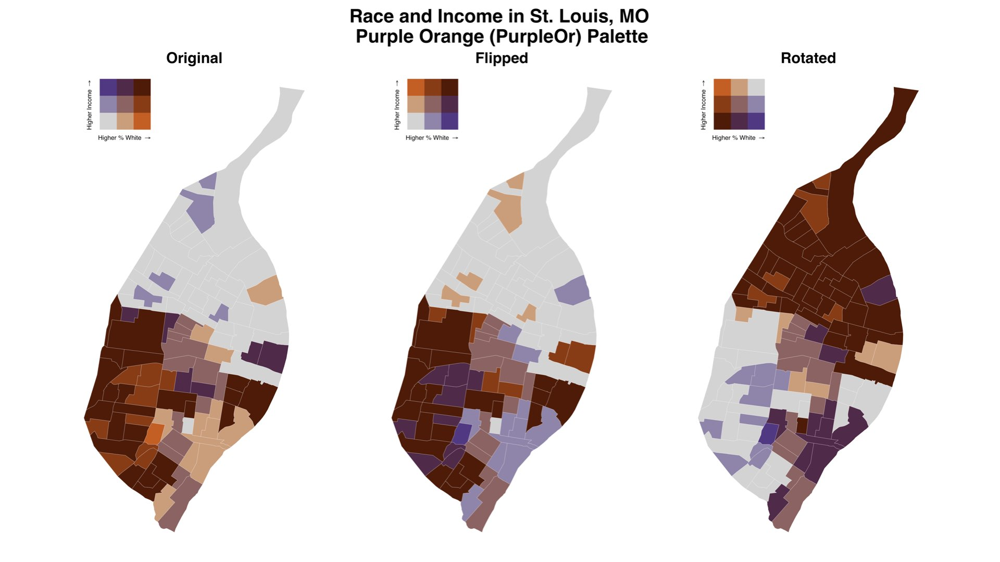
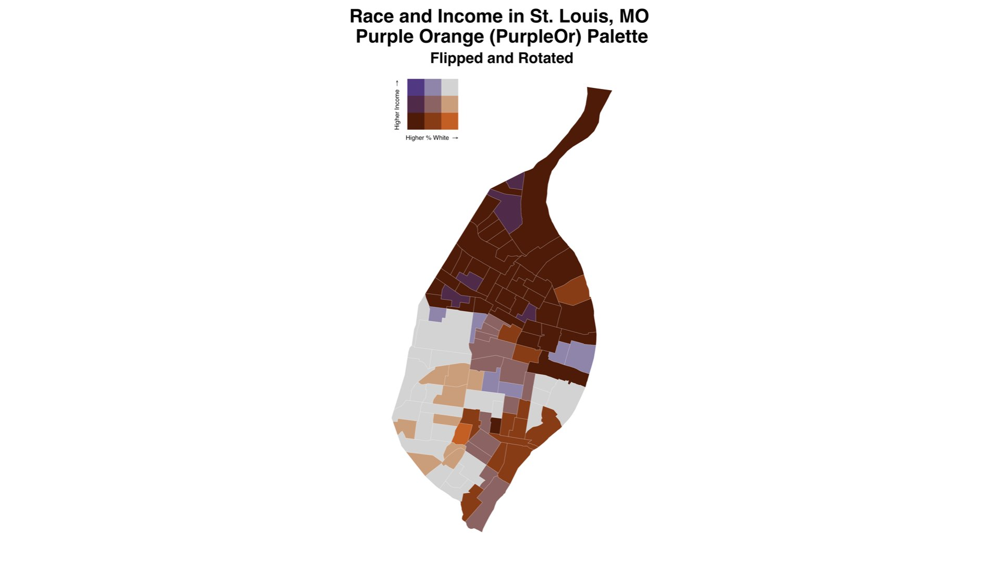

```{r setup, include = FALSE}
knitr::opts_chunk$set(
  collapse = TRUE,
  comment = "#>"
)
```

One of the important aspects of cartography and data visualization is color choice. This vignette illustrates the palettes included with `biscale`, provides an overview of palette manipulation tools, and describes the revised approach to utilizing custom palettes.

## Included Palettes
*As of v1.0.0, `biscale` supports a dozen built-in palettes and expanded ability to utilize custom palettes. For five of these palettes, there are both "primary" versions and "legacy versions."*

### Primary Palettes
All of the primary palettes listed here can be used with two-by-two (`dim = 2`), three-by-three (`dim = 3`), and four-by-four (`dim = 4`) maps. The palettes that contain a `2` at the end of their name are visually similar to the original, "legacy" palettes (see below) but utilize slightly different hex values for colors. 
```{r echo=FALSE, out.width='100%'}

```

Most of the newly added palettes not based on legacy designs were adapted from earlier work by Branson Fox.

### Legacy Palettes
To ensure compatibility with scripts written with older versions of `biscale`, the original five palettes included in the package are still available. They can be used only for two-by-two (`dim = 2`) and three-by-three (`dim = 3`) maps.

```{r echo=FALSE, out.width='100%'}
knitr::include_graphics('../man/figures/pals_legacy.jpeg')
```

The `"DkViolet"` palette was created by [Timo Grossenbacher and Angelo Zehr](https://timogrossenbacher.ch/2019/04/bivariate-maps-with-ggplot2-and-sf/), and the other four palettes were created by [Joshua Stevens](https://www.joshuastevens.net/cartography/make-a-bivariate-choropleth-map/).

## Palette Manipulations
In order to facilitate even greater flexibility with palettes, `biscale` functions include two additional arguments to manipulate their arrangement. 

"Flipping axes" will invert the colors assigned to the x and y axes. Flipping axes is accomplished with the `flip_axes` argument: 

```r
bi_pal(pal = "PurpleOr", dim = 3, flip_axes = TRUE)
```

"Rotating" the palette (with the `rotate_pal` argument) will rotate the colors 180 degrees, resulting in a palette that highlights low values as opposed to high values. Rotating the palette rotates the entire color scale 180 degrees. For example:

```r
bi_pal(pal = "PurpleOr", dim = 3, rotate_pal = TRUE)
```
These manipulations can be combined as well, producing a palette that has been both flipped and rotated:

```r
bi_pal(pal = "PurpleOr", dim = 3, flip_axes = TRUE, rotate_pal = TRUE)
```

Together, these changes to `bi_pal()` result in the following shifts to the `"PurpleOr"` palette:

```{r echo=FALSE, out.width='100%'}

```

When applied to real world data, these transformations result in subtle (in the case of flipping) or more dramatic (in the case of rotating) differences in maps:

```{r echo=FALSE, out.width='100%'}

```

Utilizing both flipping axes and palette rotations also yields a considerable change from the original:

```{r echo=FALSE, out.width='100%'}

```

Be careful to ensure that your use of `flip_axes` and/or `rotate_pal` is consistent across `bi_scale_fill()`/`bi_scale_color()` as well as `bi_legend()`.

## Custom Palettes
In addition the built-in palettes described above, `biscale` supports custom palettes. *As of v1.0.0, the workflow for using custom palettes is different than prior releases and the old approach, using `bi_pal_manual()`, has been deprecated. We plan to remove `bi_pal_manual()` in late 2022. Please update your workflows accordingly.*

To create a custom palette, users must create a named vector and supply associated hex values. We recommend checking out [Benjamin Brooke's](https://bvgsoftware.com) [Bivariate Choropleth Color Generator](https://observablehq.com/@benjaminadk/bivariate-choropleth-color-generator) if you want to experiment with creating your own palettes. [Joshua Steves' blogpost from 2015](https://www.joshuastevens.net/cartography/make-a-bivariate-choropleth-map/) also contains tips for creating palettes.

The first example below is a named vector for a two-by-two (`dim = 2`) map. The pairs correspond to `x,y` coordinates on the legend where the first value is the `x` value and the second is the `y` value. The `1-1` pair is therefore the lower left corner of the legend and, in the example, the `2-2` pair is the upper right corner. The named vector should have 4 values in total.

```r
custom_pal2 <- c(
  "1-1" = "#d3d3d3", # low x, low y
  "2-1" = "#9e3547", # high x, low y
  "1-2" = "#4279b0", # low x, high y
  "2-2" = "#311e3b" # high x, high y
)
```

If you are creating a custom palette for a three-by-three (`dim = 3`) map, you need to extend each row and column by 1 so that `3-1` and `3-2` are included in the vector along with `1-3`, `2-3`, and `3-3`. The named vector should have 9 values in total.

```r
custom_pal3 <- c(
  "1-1" = "#d3d3d3", # low x, low y
  "2-1" = "#ba8890",
  "3-1" = "#9e3547", # high x, low y
  "1-2" = "#8aa6c2",
  "2-2" = "#7a6b84", # medium x, medium y
  "3-2" = "#682a41",
  "1-3" = "#4279b0", # low x, high y
  "2-3" = "#3a4e78",
  "3-3" = "#311e3b" # high x, high y
)
```

Finally, for a four-by-four (`dim = 4`), should be further extended by 1 so that `4-1`, `4-2`, and `4-3` are included in the vector along with `1-4`, `2-4`, `3-4`, and `4-4`. The named vector should have 16 values in total.

```r
custom_pal4 <- c(
  "1-1" = "#d3d3d3", # low x, low y
  "2-1" = "#c2a0a6",
  "3-1" = "#b16d79",
  "4-1" = "#9e3547", # high x, low y
  "1-2" = "#a3b5c7",
  "2-2" = "#96899d",
  "3-2" = "#895e72",
  "4-2" = "#7a2d43",
  "1-3" = "#7397bb",
  "2-3" = "#697394",
  "3-3" = "#604e6b",
  "4-3" = "#56263f",
  "1-4" = "#4279b0", # low x, high y
  "2-4" = "#3c5c8b",
  "3-4" = "#373f65",
  "4-4" = "#311e3b" # high x, high y
)
```

You can preview and validate your named vector using `bi_pal()`. For example, we can preview the `custom_pal3` vector created above:

```r
#  load dependencies
library(biscale)

# preview palette
bi_pal(pal = custom_pal3, dim = 3)
```

Once you have created your named vector, you can use it any place where you would ordinarily provide a quoted palette name in `biscale` functions. In this example, the `custom_pal3` vector created above is passed to `bi_scale_fill()` and `bi_legend()`:

```r
# prep data
data <- stl_race_income
data <- bi_class(data, x = pctWhite, y = medInc, dim = 3, style = "quantile", keep_factors = TRUE)

# draw map
map <- ggplot() +
  geom_sf(data = data, aes(fill = bi_class), color = "white", size = 0.1, show.legend = FALSE) +
  bi_scale_fill(pal = custom_pal3, dim = 3) +
  labs(
    title = "Race and Income in St. Louis, MO",
    subtitle = "Custom Palette"
  ) +
  bi_theme()
  
# draw legend
legend <- bi_legend(pal = custom_pal3,
                  xlab = "Higher % White ",
                  ylab = "Higher Income ",
                  size = 12)
```

When custom palettes are passed to `biscale` functions, they will be validated to ensure they have the correct number of entries, have the correct names, and have properly formatted hex values.

For custom palettes that are two-by-two (`dim = 2`), three-by-three (`dim = 3`), or four-by-four (`dim = 4`), the palette manipulations described above can also be applied:

```r
bi_pal(pal = custom_pal3, dim = 3, flip_axes = TRUE, rotate_pal = TRUE)
```

## High Dimensional Palettes
The custom palette workflow not only enables users to bring whatever color scheme they wish to `biscale`, but it provides support for higher dimensional maps (`dim = 5` and beyond). Users should carefully consider the readability of these maps, however, and a warning to this effect will be generated when using `bi_class()`. Users creating high dimensional maps should also note that flipping and rotating palettes is not supported beyond `dim = 5`, and any modifications to the palette must be made manually. 

To create a named vector for a five-by-five (`dim = 5`) map, for example, the following named vector could be used:

```r
custom_pal <- c(
  "1-1" = "#d3d3d3", # low x, low y
  "2-1" = "#b6cdcd",
  "3-1" = "#97c5c5",
  "4-1" = "#75bebe",
  "5-1" = "#52b6b6", # high x, low y
  "1-2" = "#cab6c5",
  "2-2" = "#aeb0bf",
  "3-2" = "#91aab9",
  "4-2" = "#70a4b2",
  "5-2" = "#4e9daa",
  "1-3" = "#c098b9",
  "2-3" = "#a593b3",
  "3-3" = "#898ead",
  "4-3" = "#6b89a6",
  "5-3" = "#4a839f",
  "1-4" = "#b77aab",
  "2-4" = "#9e76a6",
  "3-4" = "#8372a0",
  "4-4" = "#666e9a",
  "5-4" = "#476993",
  "1-5" = "#ad5b9c", # low x, high y
  "2-5" = "#955898",
  "3-5" = "#7c5592",
  "4-5" = "#60528d",
  "5-5" = "#434e87" # high x, high y
)
```
