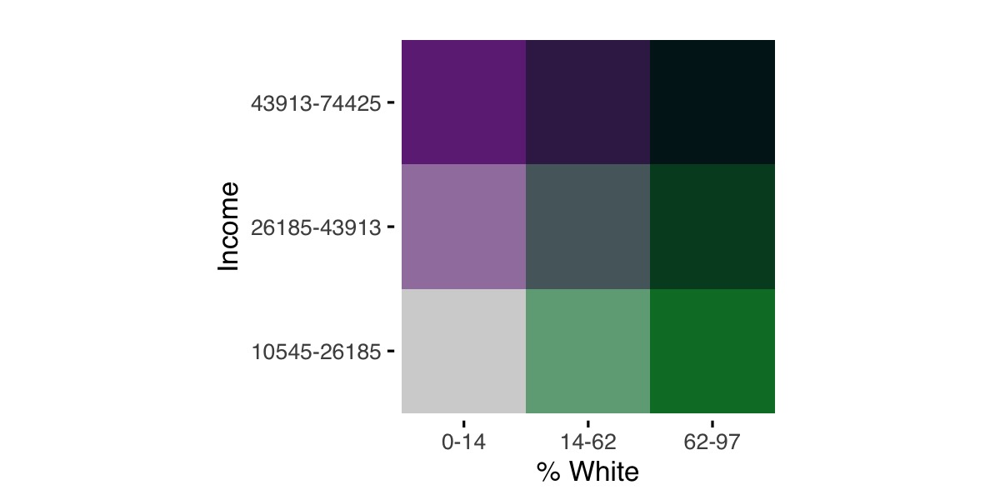
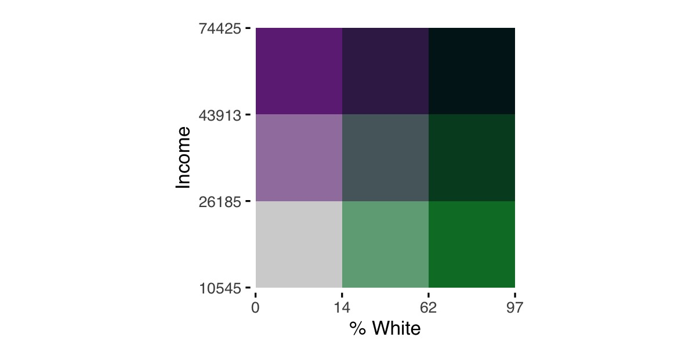
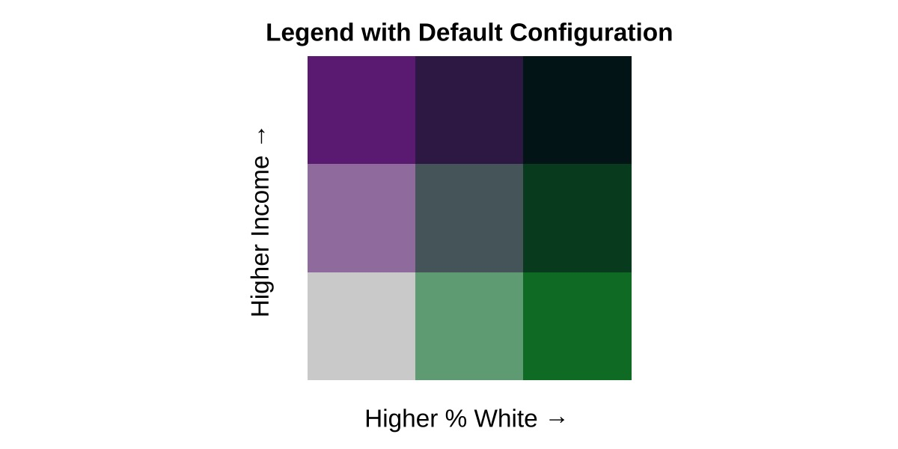

```{r setup, include = FALSE}
knitr::opts_chunk$set(
  collapse = TRUE,
  comment = "#>"
)
```

The following sets of options for breaks and legends offer expanded functionality over the basic use of the `biscale` package, allowing users to customize how their data are sorted into different bins on the legend as well as how that legend appears.

## Calculating Breaks
*As of v1.0.0, `biscale` functions accept factors as well as numeric vectors.* This allows users to exert far greater control over how bivariate classes are ultimately calculated. To start, we'll load our dependencies and sample data:

```r
## load dependencies
library(biscale)
library(classInt)

## load data
data <- stl_race_income
```

If we investigate the `pctWhite` vector in our sample data, we'll see that the data are percentage values. 

```r
> summary(data$pctWhite)
   Min. 1st Qu.  Median    Mean 3rd Qu.    Max. 
   0.00    3.14   37.31   40.84   69.87   96.73 
```

Using `style = "quantile"` will group these based on the distribution of values, yielding breaks at approximately 14% and 62%. Perhaps we would rather group our values manually, making breaks at 33.3% and 66.6% instead.

Now that `biscale` accepts factors, we can construct our breaks ahead of time and pass them to the `cut()` function from `base` `R`. We need to ensure that the breaks created have one more value than what we will use for the `dim` argument in `biscale`'s functions. Therefore, if we intend to create a three-by-three bivariate map, our breaks that are passed to `cut()`'s `breaks` argument need to have four values.

```r
data$pctWhite_bin <- cut(data$pctWhite, breaks = c(0,33.3,66.6, max(data$pctWhite)), include.lowest = TRUE)
```

Using a similar approach, you can use `classInt::classIntervals()` to calculate your breaks as well. For example, `"kmeans"` is not included as one of the styles in `biscale`, but we can apply it to our data and use it as the basis for constructing breaks:

```r
## calculate breaks
breaks <- classIntervals(data$pctWhite, n = 3, style = "kmeans")$brks

## cut data
data$pctWhite_bin <- cut(data$pctWhite, breaks = breaks, include.lowest = TRUE)
```

The `classInt::classIntervals()` is what `bi_class()` uses internally to calculate breaks for continuous variables, and it is also possible to manually replicate these calculations using this approach.

No matter the approach we've used to create it, we can use our factor `pctWhite_bin` with `bi_class()`:

```r
bi_class(data, x = pctWhite_bin, y = medInc, style = "quantile", dim = 3)
```

The `bi_class()` function will ensure that the number of factor levels in `pctWhite_bin` matches the value given for `dim`. Since `medInc` is a continuous measure, it will be binned using the `"quantile"` approach. If both the `x` and `y` variables are factors, `style` can be omitted. From this point forward, the `biscale` workflow is the same as in the basic examples.

## Customizing Legends
*As of v1.0.0, `biscale` provides two sets of tools for further customizing your legends. These include the addition of breaks or labels to each axis as well as the addition of padding between each grid square on the legend.* To start, we'll load our dependencies and sample data:

```r
## load dependencies
library(biscale)
library(classInt)

## load data
data <- stl_race_income
```

### Adding Labels to the Legend
To take advantage of `biscale`'s new functionality for adding labels or breaks to legends, there is a companion function to `bi_class()` named `bi_class_breaks()`. The arguments are largely the same, though `bi_class_breaks()` contains some additional arguments for formatting the output. These options will significantly influence what your legend looks like. Of particular note are `dig_lab`, which impacts the number of digits returned, and `split`, which will impact whether you create labels (if `split = FALSE`) or breaks (if `split = TRUE`):

```r
## example 1
labels1 <- bi_class_breaks(data, x = pctWhite, y = medInc, style = "quantile", 
                           dim = 3, dig_lab = 3, split = FALSE)
                          
## example 2
breaks2 <- bi_class_breaks(data, x = pctWhite, y = medInc, style = "quantile", 
                          dim = 3, dig_lab = c(x = 2, y = 5), split = TRUE)
```

What is crucial here is that you use the same `style` for calculating breaks as well as the same `x` and `y` columns.

The results illustrate important differences between the two examples:

```r
> ## example 1
> labels1
$bi_x
[1] "0-14"    "14-62"   "62-96.7"

$bi_y
[1] "1.05e+04-2.62e+04" "2.62e+04-4.39e+04" "4.39e+04-7.44e+04"

> 
> ## example 2
> breaks2
$bi_x
[1]  0 14 62 97

$bi_y
[1] 10545 26185 43913 74425
```

In the first example, `dig_lab = 3` is applied to both the `x` and `y` vectors, and `split = FALSE` creates labels where a range of values for each bin is show separated by a dash. Since `dig_lab = 3`, for these specific vectors, it produces inconsistently rounded values for `x` and scientific notation for `y`. 

In the second example, `dig_lab = c(x = 2, y = 5)` uses a named vector to apply different `dig_lab` values to `x` and `y`. This results in consistent decimals for `x` and no scientific notation for `y` - a big improvement! Since `split = TRUE`, we get breaks instead of labels.

The specific values needed for `dig_lab` are entirely dependent on your data, and some experimentation will likely be necessary to produce values you are happy with. We'll recreate `labels1` before proceeding, using what we learned about the best `dig_lab` values:

```r
## example 1 (modified)
labels1 <- bi_class_breaks(data, x = pctWhite, y = medInc, style = "quantile", 
                           dim = 3, dig_lab = c(2,5), split = FALSE)
```

Notice here that we use an unnamed vector for the `dig_lab` argument. `bi_class_breaks()` will accept either.

If you are using pre-made factors, these can be passed to `bi_class_breaks()` as well. Picking up from the example above, the factor variable `` is passed to the `x` argument:

```r
bi_class_breaks(data, x = pctWhite_bin, y = medInc, style = "quantile",
                dim = 3, dig_lab = c(x = NA, y = 5), split = FALSE)
```

Note that an `NA` value is passed to `dig_lab` since `pctWhite_bin` has already been created as a factor. If you are using `classInt::classIntervals()` to create your factor, use that function's `dig_lab` argument instead to prepare your labels or breaks to the desired number of decimal places.

Once you have values that are ready to use, they can be passed to `bi_legend()`. To illustrate the difference between labels and breaks, we'll place the legends next to each other for comparison. First, our code:

```r
## example 1 (modified)
legend1 <- bi_legend(pal = "PurpleGrn",
                     xlab = "% White",
                     ylab = "Income",
                     size = 12,
                     breaks = labels1,
                     arrows = FALSE)
                     
## example 2
legend2 <- bi_legend(pal = "PurpleGrn",
                     xlab = "% White",
                     ylab = "Income",
                     size = 12,
                     breaks = breaks2,
                     arrows = FALSE)
```

We have passed our objects containing labels or breaks, `labels1` and `breaks2` respectively, to the optional `breaks` argument. Since we now can see how values are changing, we can simplify the labels. In both cases, we have `arrows = FALSE` to suppress the default arrows and have less text passed to both the `xlab` and `ylab` text. Here are the results:

```{r echo=FALSE, out.width='100%'}


```

For comparison, here is the default legend:

```r
legend3 <- bi_legend(pal = "PurpleGrn",
                     xlab = "Higher % White",
                     ylab = "Higher Income",
                     size = 12) 
```
```{r echo=FALSE, out.width='100%'}

```

### Padding Within the Legend
If you desire a clearer delineation of the classifications within the palette, you can use the optional `pad_width` and `pad_color` arguments to style the legend.

```r
## adjusting padding width only
bi_legend("BlueGold", pad_width = 1.5)

## adjusting padding width and color
bi_legend("BlueGold", pad_width = 1.5, pad_color = '#000000')
```
```{r echo=FALSE, out.width='100%'}
knitr::include_graphics('../man/figures/legend_padding.jpeg')
```

