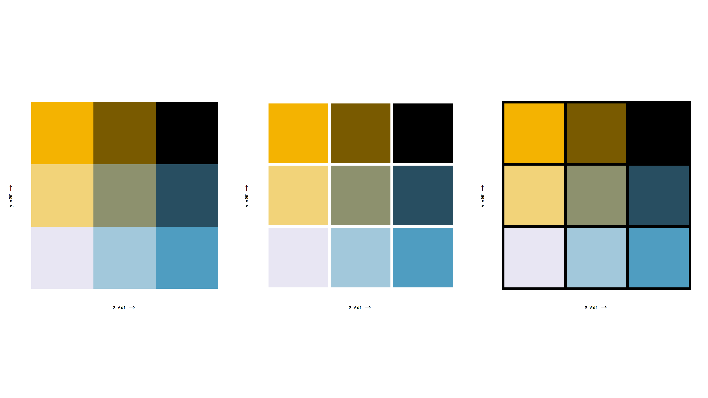
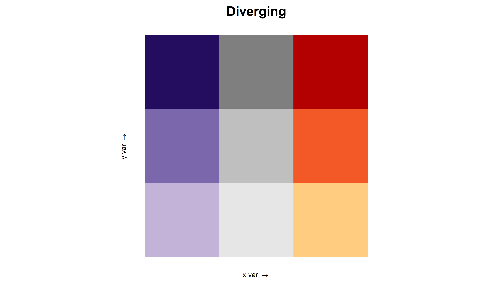
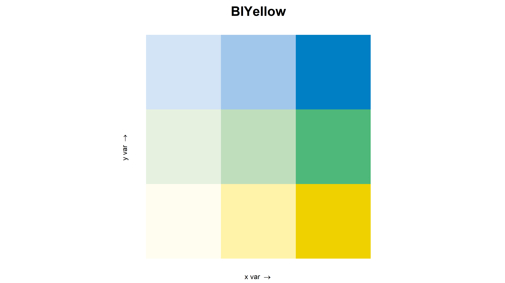

```{r setup, include = FALSE}
knitr::opts_chunk$set(
  collapse = TRUE,
  comment = "#>"
)
```

## Palettes In Biscale
Perhaps the most important aspect of data visualization is color choice. That is why as of version `0.3.0`, `biscale` now includes support for a variety of palette manipulations, as well as including 15 palettes natively. This vignette outlines the semantics of palette manipulation, and important considerations in palette choice.

## Included Palettes
`Biscale` now includes 15 palettes. The entire list of palettes is as follows:

```r
gridExtra::grid.arrange(ncol = 3,
  bi_pal("DkViolet") + labs(title = "DkViolet"),
  bi_pal("GrPink") + labs(title = "GrPink"),
  bi_pal("DkBlue") + labs(title = "DkBlue"),
  bi_pal("DkCyan") + labs(title = "DkCyan"),
  bi_pal("Brown") + labs(title = "Brown"),
  bi_pal("BlGold") + labs(title = "BlGold"),
  bi_pal("BlOrange") + labs(title = "BlOrange"),
  bi_pal("BlYellow") + labs(title = "BlYellow"),
  bi_pal("Viridis") + labs(title = "Viridis"),
  bi_pal("Diverging") + labs(title = "Diverging"),
  bi_pal("GnPink") + labs(title = "GnPink"),
  bi_pal("GnPurple") + labs(title = "GnPurple"),
  bi_pal("OrgPurple") + labs(title = "OrgPurple"),
  bi_pal("Fire") + labs(title = "Fire"),
  bi_pal("Reds") + labs(title = "Reds")
)
```
```{r echo=FALSE, out.width='100%'}
knitr::include_graphics('../man/figures/all_palettes.png')
```

## Palette Manipulations
The native palettes were prior restricted to an exact arrangement. However, there may be a desire to change the axes of the color scale. To do this, you need only supply `flip_axes = TRUE` to `bi_legend`, `bi_scale_fill` or `bi_scale_color`. **Very Important:** this argument must be specified to both your legend function **and** your scale function, or the colors will not align.

Flipping the axes inverts the color scale for the x and y axes. For example:

```r
regular <- bi_pal('DkViolet') + labs(title = 'Regular')
flipped <- bi_pal('DkViolet', flip_axes = TRUE) + labs(title = 'Flipped')
gridExtra::grid.arrange(regular, flipped, ncol = 2)
```
```{r echo=FALSE, out.width='100%'}
knitr::include_graphics('../man/figures/flipped_pal.png')
```

Rotating the palette rotates the entire color scale 180 degrees. For example:
```r
regular <- bi_pal('DkViolet') + labs(title = 'Regular')
rotated <- bi_pal('DkViolet', rotate_pal = TRUE) + labs(title = 'Rotated')
gridExtra::grid.arrange(regular, rotated, ncol = 2)
```
```{r echo=FALSE, out.width='100%'}
knitr::include_graphics('../man/figures/rotated_pal.png')
```

These techniques can be combined as well, to produce a palette that has been both flipped and rotated.
```r
regular <- bi_pal('DkViolet') + labs(title = 'Regular')
flipped <- bi_pal('DkViolet', flip_axes = TRUE) + labs(title = 'Flipped')
rotated <- bi_pal('DkViolet', rotate_pal = TRUE) + labs(title = 'Rotated')
flipAndRotate <- bi_pal('DkViolet', flip_axes = TRUE, rotate_pal = TRUE) + labs(title = 'Flipped and Rotated')
gridExtra::grid.arrange(regular, flipped, rotated, flipAndRotate, ncol = 2)
```
```{r echo=FALSE, out.width='100%'}
knitr::include_graphics('../man/figures/manipulated_pal.png')
```

As you may discern, this can drastically affect the way a bivariate map looks.

```r
data <- bi_class(stl_race_income, x = pctWhite, y = medInc, style = "quantile", dim = 3)
map <- ggplot() +
  geom_sf(data = data, mapping = aes(fill = bi_class), color = 'white', size = 0.1, show.legend = FALSE) +
  bi_theme()
  
regular <- map +
    bi_scale_fill(pal = "DkViolet", dim = 3) +
    labs(title = "Regular")
flipped <- map +
    bi_scale_fill(pal = "DkViolet", dim = 3, flip_axes = TRUE) +
    labs(title = "Flipped")
rotated <- map +
    bi_scale_fill(pal = "DkViolet", dim = 3, rotate_pal = TRUE) +
    labs(title = "Rotated")
flipAndRotate <- map +
    bi_scale_fill(pal = "DkViolet", dim = 3, flip_axes = TRUE, rotate_pal = TRUE) +
    labs(title = "Flipped and Rotated")    

gridExtra::grid.arrange(regular, flipped, rotated, flipAndRotate, ncol = 2)
```
```{r echo=FALSE, out.width='100%'}
knitr::include_graphics('../man/figures/palette_maps.png')
```

## Padding within the Legend

You may desire a clearer delineation of the classifications within the palette, or just prefer the style. To pad the cells in the legend, you need to specify a width for padding, and optionally a color. (The default is white)

```r
gridExtra::grid.arrange(ncol = 3,
  bi_legend('BlGold'),
  bi_legend('BlGold', pad_width = 2),
  bi_legend('BlGold', pad_width = 2, pad_color = '#000000')
)
```
```{r echo=FALSE, out.width='100%'}

```

## Special Palettes
`biscale` now includes some special palettes. The decision to use these palettes depends on the context of data, and this decision is left to the user. However, these consideration may be useful:

* For divergent data (where one axis represents two opposites), consider `bi_pal('Diverging')`
```{r echo=FALSE, out.width='100%'}

```

* For data with a measure of uncertainty, consider `bi_pal('BlYellow')`
```{r echo=FALSE, out.width='100%'}

```

* For categorical data, or for the most accessible palette for distinguishing between classes, consider `bi_pal('Virids')`
```{r echo=FALSE, out.width='100%'}
knitr::include_graphics('../man/figures/viridis_pal.png')
```
